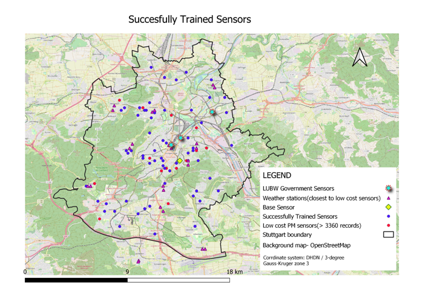
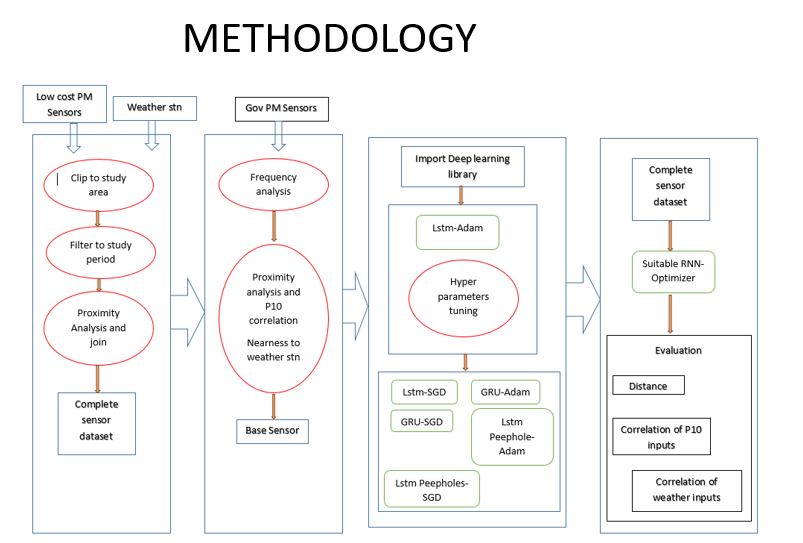
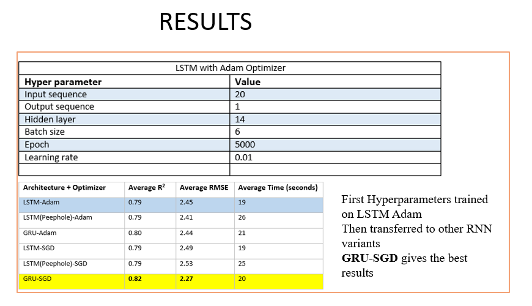

# air_pollution_prediction

## Aim: To train and evaluate the effectiveness of Recurrent Neural Networks in the prediction of air quality using low cost Particulate Matter sensors.

### Objectives:

- To identify a suitable variant of the Recurrent Neural Network for modelling air quality in Stuttgart
- To identify an appropriate optimizer for minimizing loss in Recurrent neural networks
- To investigate the possibility of tranferring Neural network hyper parameters between low cost air quality sensors

### data preparation-pyqgis

1. locating_duplicate_records.py : finds unique sensors
2. locating_3360_or_more_records.py: to get sensors with more than 3360 records
3. Individual_Weather_locating_duplicate_records.py: finds unique weather stations
4. Individual_Sensor_locating_duplicate_records.py: selects sensors with more than 3360 records
5. proximity_analysis_81_sensors.py: to find weather stations closer to the 81 sensors
6. linking_sensor_to_weatherstn.py: join sensor and weather data

### RNN

1. Base Sensor Training: Training one sensor which will serve as the base sensor. Weights and hyperparameters will be transferred to the remaining sensors.

2. data in CSV: data for 81 sensors

3. GRU_SGD: GRU RNN type with SGD optimizer

4. metrics: codebase to get metrics

## Area of Interest

Stuttgart

## Flow chart

## Conclusion

